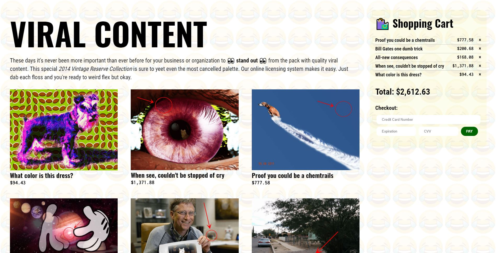

# Viral Content

See the live site [here](https://thischrisblack.github.io/viral-content/).

A shopping cart system for purchasing "viral content." The cart operates on what I call "Interest-Based Pricing," meaning that the more interested you are, the faster the price increases. Being on the page at all is a sign of interest, so all the prices are increasing a bit right from the start. 

Every interaction after that — viewing an image, adding it to the cart, trying to remove it from the cart, entering your card info — it all shows more and more interest, so the prices rise more quickly with every click. It's very terrible. I call it "Hell Cart." This is easily the most awful thing I have ever made.

Just learned React and needed an excuse to play with it and figure things out.

